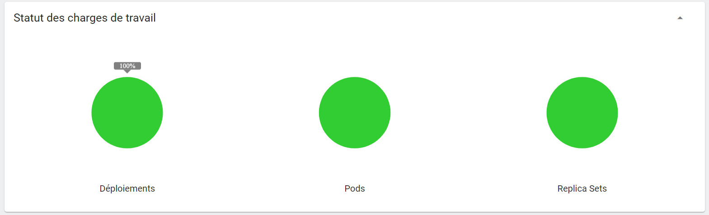

# Flask_API_Deployment_With_Docker-Kubernetes

In this project I deployed a simple application programming interface with Flask python using the Devops tools Docker and Kubernetes.

The goal of this deployment is to create 3 instances of our application and to use a load balancer to distribute the incoming traffic to our service and guarantee its availability over time.

The steps of this project are the following: 

* 1- Develop an API with Flask python and test it locally.

* 2- We create the dockerfile API to build the docker image.
* 3- Run $docker build -t wacef-flask-api . ==> the docker image is generated (check with $docker images)

* 4- $kubectl apply -f deployment.yaml ==> We create our deployment with kubernetes.

* 5- $minikube dashboard ==> Check the status of the components of our deployment on the kubernetes dashboard.

 

 

* 6- $minikube service flask-wacef-service ==> Access our deployed api and make sure it works.

